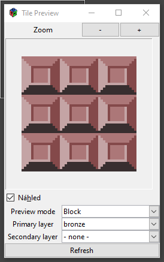
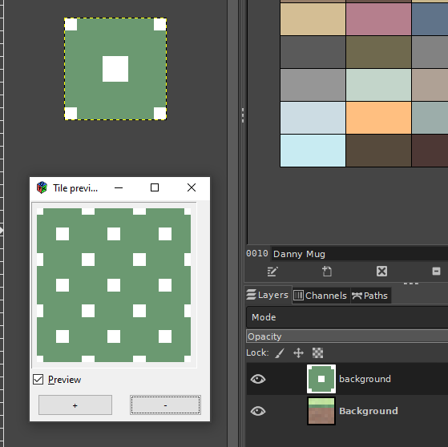
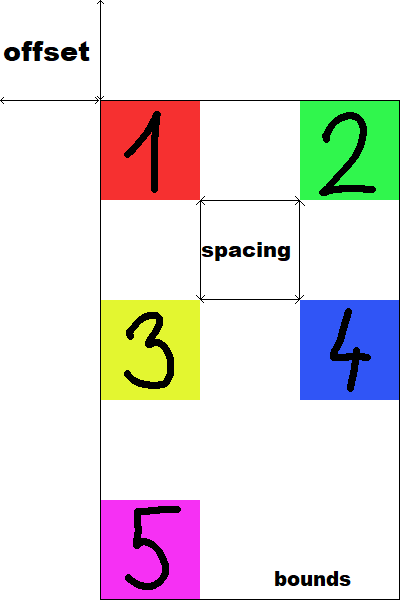
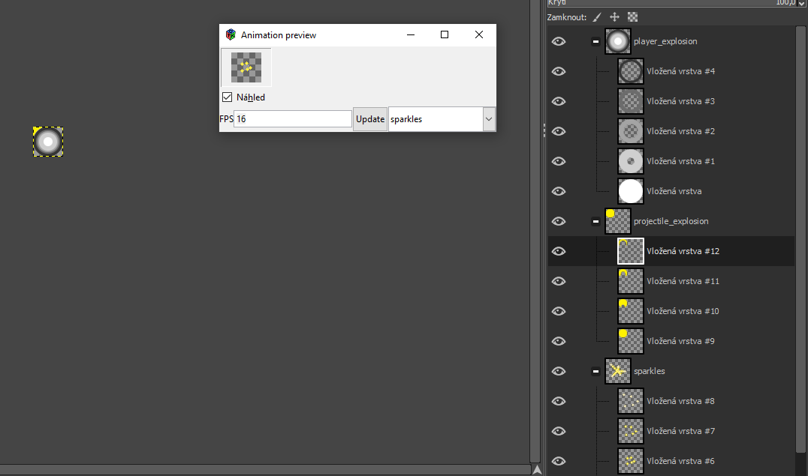
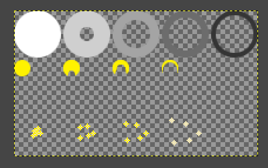

# GIMP Pixel Art Utils

This repo provides a set of plugins for more convenient pixel art work in GIMP. It is mainly aimed to help artists working on games.

## How to install

 1) Open Gimp, go to `Edit -> Preferences -> Folders -> Plug-Ins` and open one of the listed folders.
 2) Copy folders of all plugins you want to install to your `plug-ins` folder
 3) Restart Gimp, you should now see menu item called `Pixel Art` under `Tools`

## List of plugins

 * [Tile preview](#tile-preview)
 * [Tilesetize](#tilesetize)
 * [Layer Group Animation Preview](#layer-group-animation-preview)

## tile-preview

Plugin for showing how will current layer look like when tiled. It allows zooming and has live preview - you can edit your layer or even switch to a different layer and it will update.

The nature of live preview itself is a little hacky, so it updates once per second and can prompt a progress bar in status tray of Gimp or even show a loading icon on your mouse. I don't have any better solution for it at the moment.

## tilesetize

Plugin for exporting image containing tiles into tileset. It allows you to set offset from borders of the image, spacing between tiles and order of export.

It also automatically exports JSON annotations so your application can always know how the tiles are laid out even if you change your settings. The exported JSON will always have the same name as exported image, plus `.json` extension (ie.: `test.png.json`). Most of the JSON should be self explanatory, and following image should help you understand the rest.

# layer-group-animation-preview

Plugin for previewing animations stored in a layer group. This plugin is meant for pixel artists who create spritesheets (or tileset) for the game and works well in conjunction with [tilemancer](https://github.com/nerudaj/tilemancer)

## How to use

This plugin is aimed at the users of tilemancer. This guide expects you have installed tilemancer into Gimp before. Expected workflow is such that you have any number of layer groups, some of those groups containing animations, others might only contain some tiles/one shot textures.

You can preview any animation just by launching this plugin and selecting name of appropriate group from the dropdown menu. Animation is played automatically in an endless cycle, showing you live preview, so you can let it play in a corner of the screen and keep working on your animation, even adding new frames etc. You can also change FPS of the animation just by editing appropriate box and clicking `Update`.

When you are done with your spritesheet, use Filters->Animations->Tilemancer plugin, choose "One row per group" shape and confirm. Finished spritesheet will be created into separate image.

> NOTE: Tilemancer exports everything in reverse, so first item in the group will be the first item on a row. For this reason, animation preview also plays first item as the last one. This is consistent with Gimp's behaviour when exporting GIFs.
