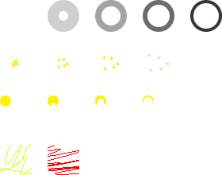

# GIMP Pixel Art Utils

This repo provides a set of plugins for more convenient pixel art work in GIMP. It is mainly aimed to help artists working on games. It has been inspired by brilliant plugin [tilemancer](https://github.com/malteehrlen/tilemancer), but evolved into something bigger.

## How to install

 1) Open Gimp, go to `Edit -> Preferences -> Folders -> Plug-Ins` and open one of the listed folders.
 2) Copy folders of all plugins you want to install to your `plug-ins` folder
 3) Restart Gimp, you should now see menu item called `Pixel Art` under `Tools`

## List of plugins

 * [Animation Preview](#animation-preview)
 * [Tile preview](#tile-preview)
 * [Spritesheetize / Tilesetize](#exporter)

# animation-preview

Plugin for previewing animations stored in a layer group. It allows you to have multiple animations within a single gimp project, each one stored in a distinct layer group (only top level layer groups are indexed for animations, so you can use layer groups on lower levels to perform blending operations). Use [spritesheetize](#spritesheetize) to export your animations to annotated spritesheet so you can use them in a game.

Animations are played in reverse, to maintain consistent behaviour with GIF exports in Gimp. That means that first layer withing your layer group (=animation clip) is the last frame of the animation.

## tile-preview

Plugin for showing how will current layer look like when tiled. It allows zooming and has live preview - you can edit your layer or even switch to a different layer and it will update.

The nature of live preview itself is a little hacky, so it updates once per second and can prompt a progress bar in status tray of Gimp or even show a loading icon on your mouse. I don't have any better solution for it at the moment.

## tilesetize 

Plugin for exporting tilesets and spritesheets. It allows you to set offset from borders and spacing between tiles (or frames).

Plugin works in two modes - if your project is a set of animation clips (top level layer groups containing sets of frames), then leave the mode set to Spritesheetize (rule of thumb - are you using Animation Preview? If yes, stick to this mode). It will try to pack the clips in somewhat efficient way (more efficient than tilemancers "One row per layer group" mode).

If your project is just a set of images (tiles), then set the mode to Tilesetize. In this mode, you can even select the order in which tiles will be placed to output image. This export results in as square output image as possible.

Both modes also automatically export JSON annotations so your application can always know how the tiles (clips) are laid out even if you change your settings or add new images. The exported JSON will always have the same name as exported image, plus `.json` extension (ie.: `test.png.json`). Most of the JSON should be self explanatory, and following image should help you understand the rest:

Example how multiple animation clips might be packed:

> NOTE: Keep in mind that this plugin toggles all of your layers visible, so it can perform the export.
