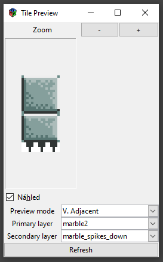

# GIMP Pixel Art Utils

This repo provides a set of plugins for more convenient pixel art work in GIMP. It is mainly aimed to help artists working on games. It has been inspired by brilliant plugin [tilemancer](https://github.com/malteehrlen/tilemancer), but evolved into something bigger.

## How to install

 1) Open Gimp, go to `Edit -> Preferences -> Folders -> Plug-Ins` and open one of the listed folders.
 2) Copy folders of all plugins you want to install to your `plug-ins` folder
 3) Restart Gimp, you should now see menu item called `Pixel Art` under `Tools`

## List of plugins

 * [Tile preview](#tile-preview)
 * [Tilesetize](#tilesetize)
 * [Animation Preview](#animation-preview)

## tile-preview

Plugin for showing how will current layer look like when tiled. It allows zooming and has live preview - you can edit your layer or even switch to a different layer and it will update.

The nature of live preview itself is a little hacky, so it updates once per second and can prompt a progress bar in status tray of Gimp or even show a loading icon on your mouse. I don't have any better solution for it at the moment.

## tilesetize

Plugin for exporting image containing tiles into tileset. It allows you to set offset from borders of the image, spacing between tiles and order of export.

It also automatically exports JSON annotations so your application can always know how the tiles are laid out even if you change your settings. The exported JSON will always have the same name as exported image, plus `.json` extension (ie.: `test.png.json`). Most of the JSON should be self explanatory, and following image should help you understand the rest.

> NOTE: Keep in mind that this plugin toggles all of your layers visible, so it can perform the export.

# animation-preview

Plugin for previewing animations stored in a layer group. It allows you to have multiple animations within a single gimp project, each one stored in a distinct layer group (only top level layer groups are indexed for animations, so you can use layer groups on lower levels to perform blending operations). Use [spritesheetize](#spritesheetize) to export your animations to annotated spritesheet so you can use them in a game.

Animations are played in reverse, to maintain consistent behaviour with GIF exports in Gimp. That means that first layer withing your layer group (=animation clip) is the last frame of the animation.

# spritesheetize

Plugin for exporting animations into a spritesheet image. It also exports JSON annotations for that spritesheet so you can load it programatically and not rely on concrete number of frames or positions of elements (as those can easily change).

It uses very barebones fitting algorithm so the resulting spritesheet is smaller than one from tilemancer.

> NOTE: Keep in mind that this plugin might toggle some of your layers visible, so it can perform the export.