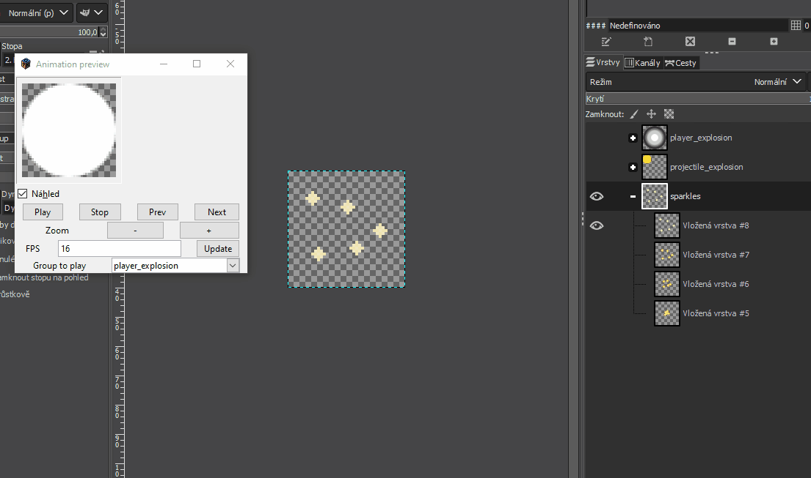

# GIMP Pixel Art Utils

This repo provides a set of plugins for more convenient pixel art work in GIMP. It is mainly aimed to help artists working on games. It has been inspired by brilliant plugin [tilemancer](https://github.com/malteehrlen/tilemancer), but evolved into something bigger.

## How to install

 1) Open Gimp, go to `Edit -> Preferences -> Folders -> Plug-Ins` and open one of the listed folders.
 2) Copy contents of the `plug-ins` folder over to Gimp's `plug-ins` folder
 3) Restart Gimp, you should now see menu item called `Pixel Art` under `Tools`

## List of plugins

 * [Animation Preview](#animation-preview)
 * [Load as tiles](#load-as-tiles)
 * [Tile preview](#tile-preview)
 * [Spritesheetize](#exporter)

### animation-preview

Plugin for previewing animations stored in a layer group. It allows you to have multiple animations within a single gimp project, each one stored in a distinct layer group (only top level layer groups are indexed for animations, so you can use layer groups on lower levels to perform blending operations). Use [spritesheetize](#exporter) to export your animations to annotated spritesheet so you can use them in a game.

Animations are played in reverse, to maintain consistent behaviour with GIF exports in Gimp. That means that first layer withing your layer group (=animation clip) is the last frame of the animation.

### load-as-tiles

This plugin allows you to take a spritesheet or tilesheet and import it to gimp as individual frames. First, you need to figure out the frame size of your input sprite(tile)sheet and create a new project where image size has the same dimensions as the target tile. Then you can open the plug in, point it to your input file, specify frame spacing, offset of first frame and frame size. The plug in will then import the individual frames.

### tile-preview

Plugin for showing how will current layer look like when tiled under various conditions and can even show you how the tile looks in combination with other tiles. Due to performance issues, there is no live preview, you have to use manual refresh button. Preview can also be zoomed.

Tile preview works in couple different modes:

* Block - shows tile in 3x3 tile configuration. If secondary layer is selected, it will make the borders, leaving the primary as the center tile.
* Floor - shows tile as 3x1 floor configuration. If secondary layer is selected, it will be used for edge tiles.
* Columns - shows tile as 1x3 column configuration. If secondary layer is selected, it will be shown as additional columns on the left and on the right.
* V. Adjacent - means vertically adjacent. Shows 1x2 column configuration where primary layer is the top tile and secondary layer is the bottom tile.

## Spritesheetize 

Plugin for exporting tilesets and spritesheets. It allows you to set offset from borders and spacing between tiles (or frames).

If your project is just a collection of individual tiles (even if some of them are layout groups), uncheck the "Export layer groups as animation clips". This way you'll get a regular tileset. This mode is called "tilesetize" and it will pack your tiles into a roughly square texture. You can override the number of of tiles exported per row using the "Enforce specific tiles per row" and setting the number below to nonzero value. Also, if you imported the tiles using the "Load as tiles", the order is likely reversed from what you'll want, so check "Export in inverted order" in that case.

If your project is a collection of layer groups with each group being an individual animation, check the "Export layer groups as animation clips". This will enable the "spritesheetize" mode. Each animation clip will be exported onto a single row in the output texture. In case you have some very long and some very short clips, multiple shorter clips might be packed onto the same row to save space.

Both modes export a JSON annotation file that your application can use to figure out how many animations are there, where they are placed. Since the export is non-deterministic based on how many tiles / frames you have, this annotation file is a stable bridge between your Gimp project and your game.

If you're exporting in the "tilesetize" mode, the annotation will be exported as `<filename>.clip`. If you're exporting in "spritesheetize" mode, the annotation will be exported as `<filename>.anim`.

Example how multiple animation clips might be packed:

> NOTE: Keep in mind that this plugin toggles all of your layers visible, so it can perform the export.
